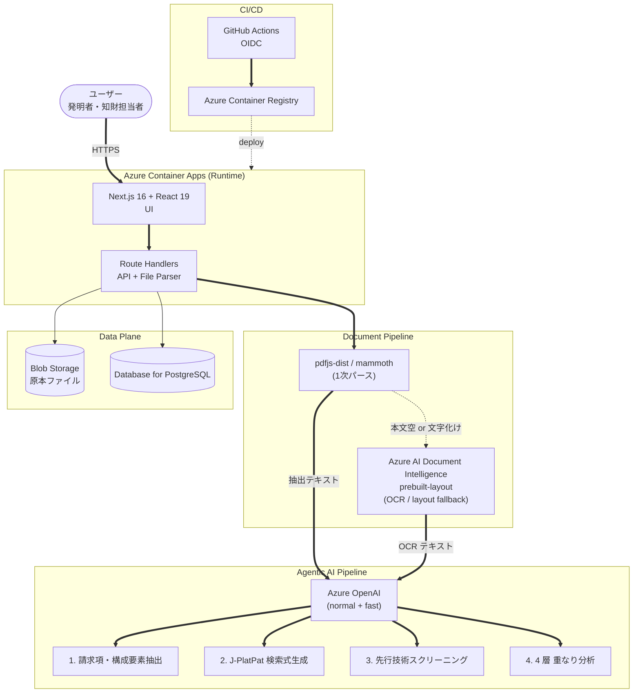
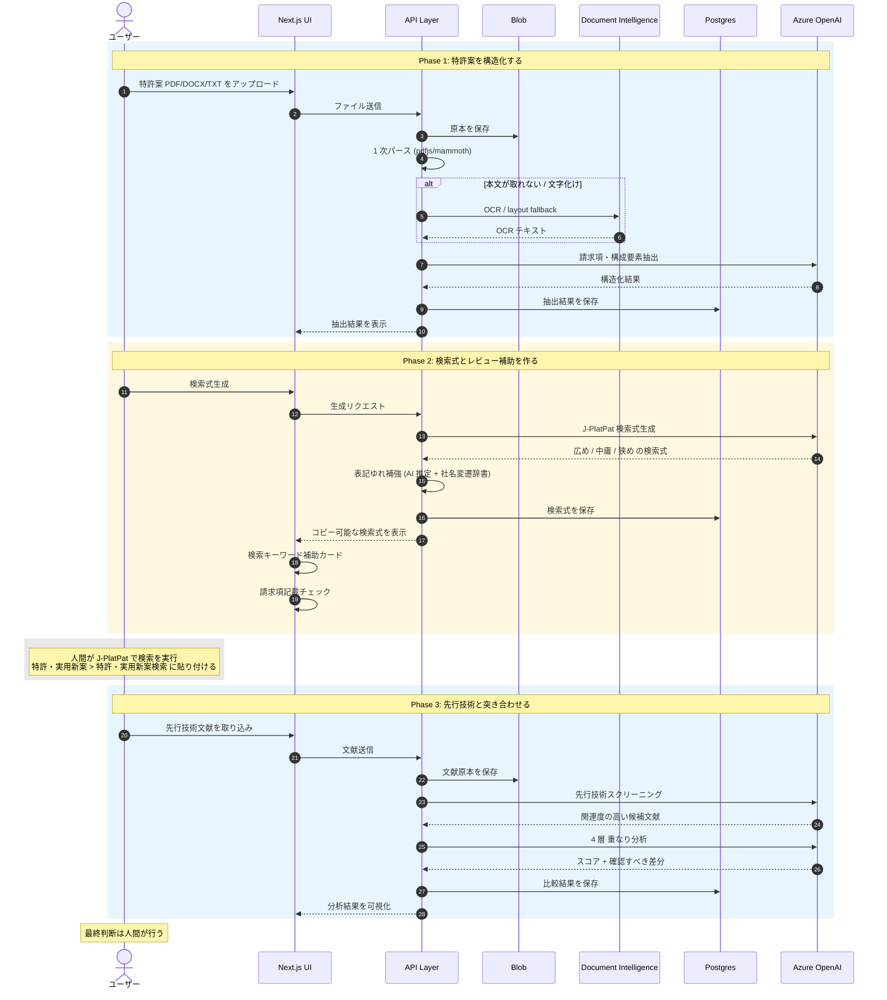
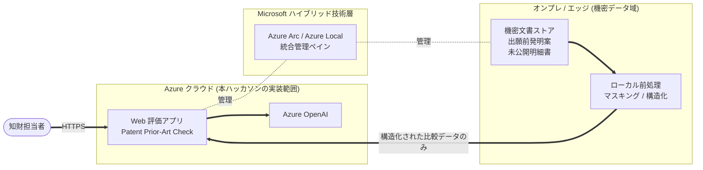

発明者本人。企業の知的財産部門の担当者。新規事業のリーダー。研究開発部門のエンジニア。スタートアップの創業者。

特許の世界に関わる人の多くは、もともと **「特許調査の専門家」ではありません**。それなのに、出願や事業判断の手前で、必ず **先行技術調査** という壁が立ちはだかります。

J-PlatPat を開く。検索ボックスの前で、手が止まる。

「何を、どの順番で、どう検索すれば、本当に危ない先行技術にたどり着けるのか」  
「自分の発明を、検索式に翻訳するために、どう構成要素を切り分ければいいのか」  
「ヒットした文献のうち、自分の請求項とぶつかるのはどれで、どこが衝突しているのか」

これが、特許調査でいちばん属人的で、いちばん削りにくく、いちばん **「自分は専門家ではないのに、この判断責任を取らされている」** と感じる前半作業です。

そして企業の現場には、**もう一つの壁** があります。

> 「機密文書はクラウドに上げられない」

私たちが特許事務所・企業知財部の方々と直接対話を重ねる中で、繰り返し聞いた声です。出願前の発明案、他社特許との比較資料、未公開の技術情報。こうした機密データを、SaaS 型の AI に投げることはできない。一方で、AI を活用しなければ業務は前に進まない。

**この「機密の壁」と「AI 活用の要請」の板挟み** こそが、日本のエンタープライズ知財の現実です。

今回の Microsoft Agent Hackathon に向けて、私たち KIRIKO.tech はこの **2 つの壁を Azure で越える** ための PoC、**Patent Prior-Art Check** を作りました。

- 公開 URL: https://ca-patentai-mini.ambitiousocean-c848492c.japaneast.azurecontainerapps.io/
- 完成済みデモケース: https://ca-patentai-mini.ambitiousocean-c848492c.japaneast.azurecontainerapps.io/cases/14
- 新規操作用サンプル: `docs/judge-samples/patent-prior-art-check-judge-samples.zip`

なお、本ハッカソンで実装したのは **Azure クラウド側で動く PoC** です。タイトルの「閉域で使える」は、機密データ処理を Azure Arc / Azure Local 経由でオンプレ・エッジ側に切り出す **次フェーズの設計思想** を含めたものです。今回のアプリは、そのクラウド側コンポーネントとして、Azure Container Apps 上で実際に動作する形まで実装しました。

## デモ動画

@[youtube](VIDEO_ID)

3 分で、PDF アップロードから 4 層の重なり分析までを通しで見せます。

審査員の方が **新規ケース作成から通し操作を試す** 場合に備えて、軽量な TXT サンプルも用意しています。`docs/judge-samples/patent-prior-art-check-judge-samples.zip` を展開し、`README.md` の手順に沿って、特許案サンプルと先行技術サンプルを順番にアップロードしてください。完成済みデモケースを見るだけでなく、請求項抽出、検索式生成、請求項記載チェック、先行技術取り込み、4 層分析までを実際に確認できます。

## 作ったもの

特許案の PDF / DOCX / TXT をアップロードすると、

1. Azure OpenAI が請求項と構成要素を抽出し、
2. J-PlatPat に貼り付けて、**人間が確認・調整しながら使える** 検索式を 3 段階の粒度（広め・中庸・狭め）で生成し、
3. 取り込んだ先行技術文献との重なりを **「語彙」「構成要素」「意味」「構造」の 4 層** で分析する

Web アプリです。

重要なのは、このアプリは **特許の最終判断を AI に置き換えるものではない** ということです。狙いは、出願前や調査初期に「どの観点で検索し、どの文献から優先的に読むべきか」を整理すること。人間の専門家が判断する **前段階の、調査設計と比較作業** を支援します。

## なぜこの課題を選んだか

KIRIKO.tech は AI スタートアップであると同時に、**自社で特許出願を行っている当事者** でもあります。2026 年 3 月には主力プロダクト **GARDIA**（閉域網対応のエンタープライズ AI 文書基盤）の基盤技術について **自分たちの手で** 特許出願を行い、続く第 2 出願も自社で準備中です。請求項の作成、先行技術調査、明細書執筆、出願手続き。すべて自分たちで経験してきました。

つまり私たちは、

- **発明する側**（スタートアップとしての発明者）
- **出願する側**（自分の手で明細書を書く本人出願者）
- **特許 AI を作る側**（知財ドメインに特化した AI 基盤 GARDIA の開発者）

の 3 つの立場を同時に経験しています。

### Phase 1 で見えたコストの壁、現場で聞いた機密の壁

GARDIA の前身として、私たちは **GENIAC**（経済産業省の生成 AI 開発支援プロジェクト）で **特許検索 AI** のプロトタイプを開発し、特許庁の審査官の方々にテスト利用してもらいました。AWS 上に VPC 構成で実装した、いわばエンタープライズ向け閉域 AI のフル装備版です。

ここで見えたのが **コストとスケールの壁** でした。VPC 前提のインフラは堅牢ですが、中小企業や個人特許事務所に展開するには重すぎる。

そして同時に、現場のヒアリングから、もう一つの声が浮かび上がってきました。

> 「機密文書はクラウドに上げられない」  
> 「公開特許の検索結果は外でいい。でも、比較する自社の発明案は外に出したくない」

ここから生まれた設計思想が、**「Web（AI 処理）× スタンドアロン（機密データ）」のハイブリッド構成** です。検索式の生成や公開文献の構造化のような汎用処理は Web 側の AI でやり、機密情報そのものを扱う部分はオンプレやエッジに残す。**AI を使いつつ、機密の壁を越えない** ための割り切りです。

この新アーキテクチャ自体も特許として準備中で、本ハッカソンのプロダクトは、その **Phase 2 の Web 側（AI 評価アプリ）を Azure 上に実装する** という位置づけです。

### 特許調査の本当のボトルネック

特許調査の最大のボトルネックは、**「検索する」ことではなく「検索の前に頭の中で起きる作業」と「検索の後に文献を読み解く作業」** だと考えています。

検索ボックスにキーワードを入れるだけなら、誰でも 10 秒でできます。

しかし、自分の発明を「課題 / 解決手段 / 構成要素 / 効果」に分解し、それを J-PlatPat の検索構文に翻訳し、返ってきた数十〜数百件の文献から「実際にぶつかる数件」を絞り込み、その数件と自分の請求項を **語彙・構成要素・意味・構造** のレベルで突き合わせる。この一連の作業に、半日から数日が消えていきます。

そして本当に厄介なのは、この作業をする人の多くが、特許調査を本職としていないことです。発明者本人は発明のプロであって調査のプロではなく、知財部のジュニア担当者は法務のプロであっても発明分解のプロではない。新規事業のリーダーは事業のプロであっても特許構文のプロではない。

**「自分は専門家ではないのに、専門的な判断を求められる」** という構造的な負荷が、この前後の作業にずっと張り付いています。

ここに **Agentic AI が刺さる余白がある**。これが今回の出発点です。

## なぜ単発の LLM ではなく Agentic AI なのか

特許調査は、一発のプロンプトで終わる仕事ではありません。人間がこれを行うとき、頭の中では次のような **役割が切り替わって** います。

| 役割 | やっていること |
| --- | --- |
| 発明分解者 | 自分の発明を請求項・課題・効果・構成要素に分解する |
| 検索戦略家 | どの語彙・どの粒度・どの組み合わせで検索式を組み立てるか考える |
| スクリーナー | 検索結果から「関係なさそう」を素早く落とす |
| 比較分析者 | 残った文献を請求項と突き合わせ、どこが近く、どこが違うかを言語化する |

このアプリでは、それぞれの役割を **専門タスクに分解された AI 処理** として実装しました。単発のチャットボットや単発の RAG ではなく、**役割ごとに最適化されたプロンプトと構造化出力スキーマを持つ複数のステップが、人間の判断点を間に挟みながら直列・並列に動く** 構成です。

| ステップ | AI の役割 | 人間の役割 |
| --- | --- | --- |
| 1. 特許案の構造化 | 請求項・課題・効果・構成要素を抽出 | 入力文書を確認する |
| 2. 検索式生成 | J-PlatPat 向けの検索式・キーワード群を 3 粒度で生成 | 検索式をコピーし、J-PlatPat で確認・調整して実行 |
| 3. 文献取り込み | CSV / PDF / DOCX / TXT を取り込み、比較対象として保存 | 結果から取り込む文献を選ぶ |
| 4. 文献スクリーニング | 関連度の高い文献を絞り込み | 候補が妥当か確認 |
| 5. 4 層 重なり分析 | 一致候補・差分・確認ポイントを整理 | 最終判断 |

設計の核は、**AI に法的判断をさせないこと** です。出力では「新規性なし」「登録不可」といった断定を避け、「重複候補」「確認が必要な差分」「人間が見るべきポイント」として提示します。これは私たち自身が出願者として「AI に勝手に結論を出されると困る」立場にいるからこそ、強く意識した設計です。

## アーキテクチャ（ハッカソンスコープ：Azure クラウド側）



### Agentic AI ワークフローの時系列



主要な構成要素は次の通りです。

- **Frontend**: Next.js 16 / React 19
- **API**: Next.js App Router Route Handlers
- **AI**: AI SDK + `@ai-sdk/azure`
- **Runtime**: Azure Container Apps
- **Model**: Azure OpenAI（通常用 / 高速用の 2 デプロイメントを用途で切り替え）
- **DB**: Azure Database for PostgreSQL + Drizzle ORM
- **File storage**: Azure Blob Storage
- **PDF parsing**: pdfjs-dist + `@napi-rs/canvas`
- **DOCX parsing**: mammoth
- **OCR / layout fallback**: Azure AI Document Intelligence (`prebuilt-layout`)
- **CI/CD**: GitHub Actions + Azure OIDC + Azure Container Registry

## 実装で工夫したこと

### 1. Azure OpenAI を主軸に、provider を切り替え可能にした

AI SDK の抽象化を使い、`AI_PROVIDER=azure` のときに Azure OpenAI を呼び出す構成にしました。

Azure OpenAI 特有の事情として、

- モデル名ではなく **deployment name** で指定する必要がある
- 通常用と高速用で別のデプロイメントを使い分けたい

を踏まえ、以下の環境変数で切り替えられるようにしています。

```text
AZURE_OPENAI_DEPLOYMENT_NAME
AZURE_OPENAI_FAST_DEPLOYMENT_NAME
AZURE_OPENAI_API_VERSION
AZURE_RESOURCE_NAME / AZURE_OPENAI_BASE_URL
```

他 provider 固有の `providerOptions` が Azure 側に漏れないよう、provider ごとに条件分岐しています。

### 2. 自由文ではなく、構造化出力でつなぐ

AI 出力は Zod スキーマ付きの **構造化出力** に寄せました。後段のステップが前段の出力に依存する場合、文章ではなく型で受け渡せると、ステップ間が「壊れない API」になります。

主な AI 処理は次の 3 つです。

- `src/lib/extract-claims.ts`: 発明名称・要約・課題・効果・請求項・構成要素を抽出
- `src/lib/generate-queries.ts`: J-PlatPat 向けに広め / 中庸 / 狭めの検索式 + キーワード群を生成
- `src/lib/analyze-overlap.ts`: 先行技術文献のスクリーニング + 4 層分析

特に検索式生成では、J-PlatPat の検索構文（`/CL`, `/TX`, `*`, `+`, `?` など）の使い方をプロンプトに明示しました。単にキーワードを並べるのではなく、**検索欄に貼り付け、人間が確認・調整しながら使えるたたき台** を目標にしています。

また、J-PlatPat では **トップページの「簡易検索」ではなく、`特許・実用新案` → `特許・実用新案検索` の検索項目欄に貼り付ける** よう、画面上の案内も追加しました。審査員や初見ユーザーが実際に触ることを考えると、この導線の明示は地味ですが重要です。

### 3. 表記ゆれ・社名変遷への対応

特許調査では、技術キーワードだけでなく、**出願人名や企業名の表記ゆれによって検索漏れが起きること** が頻繁にあります。

たとえば、現在の社名では `パナソニック` として知られていても、古い文献では `松下電器産業` や `松下電器`、英語表記では `Panasonic` として現れる可能性があります。同じ会社の特許なのに、検索する人がこの変遷を知らないと、関連特許を取りこぼします。

そこで、検索クエリ生成時に以下を補助する仕組みを追加しました。

- 漢字・カタカナ・英語表記のゆれ
- 旧社名と現社名の対応
- 出願人名検索で漏れやすい候補の提示
- J-PlatPat で追加確認すべきキーワード候補の生成

実装の核は、**AI 推定と辞書のハイブリッド構成** です。

- **AI 推定**: LLM が文脈から推定した候補（柔軟だが不確実）
- **辞書候補**: 代表的な社名変遷を扱う小さな辞書からの候補（確実だが範囲限定）

画面上では **`AI 推定` / `辞書候補`** のラベルで出所を明示しました。ユーザーは「これは辞書から出ている候補」「これは AI の推定なので確認して使う候補」を区別して扱えます。

### 4. 検索キーワード補助カード

社名変遷や表記ゆれに加えて、特許調査にはもう一つ大きな落とし穴があります。それは、**発明者が普段使っている言葉と、特許文献で使われる言葉が一致しない** ことです。

たとえば `アイスクリーム` という言葉で検索しても、特許文献では `冷菓`、`氷菓`、`冷凍菓子`、英語では `frozen confection` と書かれていることがあります。`スマホ` は `携帯端末` や `情報処理端末`、`AI` は `機械学習`、`学習済みモデル`、`推論モデル` といった表現で現れます。

そこで、検索式生成結果の近くに **「検索キーワード補助」カード** を追加しました。

このカードは、AI のレスポンスや DB スキーマを変更せず、**既存の発明情報・検索キーワードを画面側で読み取って、辞書・ルールベースで関連語を提示する** 安全な補助機能です。

表示するカテゴリは次の通りです。

- 中心語
- 同義語・近義語
- 上位概念
- 下位概念
- 業界語・特許表現
- 英語キーワード
- 検索漏れ注意
- 広すぎ注意
- 人手確認ポイント

初期辞書では、実務で検索漏れしやすい代表的な語を対象にしました。

| 中心語 | 補助候補の例 |
| --- | --- |
| アイスクリーム | アイス、冷菓、氷菓、冷凍菓子、ice cream、frozen confection |
| 自動車 | 車、車両、移動体、乗物、vehicle、automobile |
| スマホ | 携帯端末、情報処理端末、通信端末、smartphone、mobile terminal |
| アプリ | プログラム、情報処理方法、情報処理装置、software、application |
| AI | 機械学習、学習済みモデル、推論モデル、ニューラルネットワーク、machine learning |
| 電池 | 蓄電池、二次電池、蓄電デバイス、battery、rechargeable battery |

この機能の狙いは、AI に新しい判断をさせることではありません。専門家なら自然に思いつく **「検索語の引き出し」** を、非専門家にも見える形で並べることです。

### 5. 請求項記載チェック

提出直前の実務補助として、軽量な **「請求項記載チェック」** も追加しました。

これは、請求項の法的適否を AI が判定するものではありません。あくまで、出願前に人間が確認すべき可能性のある箇所を整理するための補助機能です。

チェック対象は、MVP として次の 5 つに絞りました。

- 曖昧表現
- 請求項と明細書本文の用語照合
- 用語の揺れ
- 「前記」「当該」「該」などの参照関係
- 請求項間の引用関係

実装は `src/lib/claim-draft-check.ts` の pure function として切り出し、LLM 呼び出しや DB migration は行っていません。既存のアップロード、請求項抽出、検索式生成、先行技術取り込み、4 層分析には影響しない読み取り専用の補助として追加しています。

ここでも重要なのは、AI に「明確性違反」「サポート要件違反」といった法的結論を出させないことです。表示はあくまで「確認候補」「人手確認ポイント」に留め、最終判断は知財担当者・弁理士等が行う設計にしています。

### 6. 特殊ケースはオプションと Q/A に分けた

ユーザーからのフィードバックで、**「公開前の出願済み特許に新規事項を付け加える特許ですか？」という導線は特殊ケースに見える** という指摘がありました。

そこで、この扱いは通常フローの中心に置かず、**「公開前のベース出願に新規事項を追加して調査する」** という任意オプションとして整理しました。画面上では Q/A 形式で、

- どんな場合に使うオプションなのか
- 通常の発明案アップロードではオフでよいこと
- 国内優先権の可否や補正可否などの法的判断は行わないこと

を明示しています。

これも、実務導入ではかなり重要な調整です。専門家には伝わる言い方でも、初見の審査員や発明者本人には誤解されることがある。PoC だからこそ、画面上の言葉を「実際に触る人が迷わない形」に寄せました。

### 7. 重なり分析を「4 層」に分けた

先行技術との比較を単一のスコアで返すと、実務的にはほぼ使えません。

実際の調査では、「単語が似ているだけ」「構成要素が対応している」「表現が違うが意味が同じ」「処理の構造が同じ」は、それぞれ判断の重みが違います。そこで、次の 4 層でスコアと根拠を出す設計にしました。

| 層 | 見るもの |
| --- | --- |
| L1 語彙 | 主要語句や表現の表面的な近さ |
| L2 構成要素 | 部品・処理・制約・入出力・効果の対応関係 |
| L3 意味 | 言い換えや同義表現を含めた近さ |
| L4 構造 | 処理順序や要素間関係の近さ |

この 4 層に分けたことで、「似ているらしい」で終わらず、**どこが近くて、どこが違うのか** を読み手が短時間で把握できるようになりました。これが本アプリの差別化要素です。

### 8. 多様な日本語ファイルを読むための 2 段構え

Next.js のサーバー側で PDF を読むとき、`pdfjs-dist` の worker・標準フォント・CMap の扱いは「ローカルでは動くが本番で壊れる」典型箇所です。

このアプリでは、

- `scripts/copy-pdfjs-assets.mjs` で `vendor/pdfjs-dist` に必要なアセットをコピー
- `src/lib/parse-file.ts` から明示的に読み込む
- `@napi-rs/canvas` で Node runtime 上の DOM 系 polyfill を補う

という対応を入れ、**Azure Container Apps 本番環境で日本語 PDF からテキスト抽出できる** ことを確認しました。

さらに、**スキャン画像だけの PDF や文字化けが疑われる PDF** に備えて、`pdfjs-dist` での抽出結果が空・もしくは不自然な文字列だった場合は、**Azure AI Document Intelligence の `prebuilt-layout` にフォールバック** する 2 段構えの設計にしました。

- **1 次パース**: `pdfjs-dist` / `mammoth`（軽量・低レイテンシ）
- **2 次フォールバック**: Azure AI Document Intelligence（OCR + レイアウト解析）

本番環境で、画像だけの PDF でも Document Intelligence の OCR フォールバックによりテキスト抽出できることを確認しました。文字数そのものを品質指標とはせず、**空文字で止まらず、後続の請求項抽出・検索式生成へ進めること** を重視しています。表だけで構成された DOCX についても、表セル内のテキストを取り込めることを確認しています。

### 9. 原本ファイルは Blob Storage、メタデータは Postgres

アップロードされた特許案や先行技術文献は Azure Blob Storage に保存し、DB には Blob 名・元ファイル名・content type・サイズなどのメタデータを保存しています。

これにより、コンテナのローカルディスクに依存せず、Container Apps の特性（インスタンスが揮発する前提）と整合する構成になっています。ケース削除時には関連 Blob も best effort で削除します。

初期構成では Turso/libSQL を想定していましたが、Azure 環境に揃えるため Postgres へ移行しました。

- `drizzle.config.ts` を `dialect: "postgresql"` に変更
- `src/db/index.ts` を `drizzle-orm/node-postgres` に変更
- スキーマを `pgTable` に書き換え

主要テーブルは `cases` / `draft_patents` / `search_query_sets` / `prior_art_documents` / `comparison_results` の 5 つです。

### 10. 審査員が実際に触っても止まりにくいようにした

ハッカソンでは、審査員が実際に公開 URL からアプリを操作します。そのため、提出直前には新機能追加よりも **「触っている途中で止まらないこと」** を優先して仕上げました。

具体的には、Azure OpenAI の一時的な応答失敗に備えて、請求項抽出・検索式生成・4 層分析に retry と deterministic fallback を追加しました。

通常時は Azure OpenAI による構造化出力を使います。一方で、AI 側の一時的な失敗やタイムアウト、または空の請求項配列が返ってきた場合でも、画面が 500 エラーで止まるのではなく、ルールベースの最低限の補助結果を返し、人間レビューへ進められるようにしています。

この fallback は法的判断を行うものではありません。あくまで「AI が一時的に使えないときでも、調査作業を完全に止めない」ための安全弁です。

また、Azure Container Apps は `minReplicas=1` に設定し、スケールゼロからのコールドスタートを避ける構成にしました。審査員の初回アクセス時にも、トップページとデモケースがすぐ表示されることを重視しています。

## 「Web で AI 処理、機密はクラウドに出さない」という分離思想

このアプリの設計判断には、エンタープライズ向け閉域 AI の文脈で重要な選択が 2 つあります。これは一見ばらばらに見えますが、**「エージェントは万能ではない。ワークフロー全体で、人間とインフラ境界に役割分担させる」** という同じ思想の表れです。

### 判断 1: J-PlatPat を自動操作しない

技術的には J-PlatPat をブラウザ自動化で叩く選択肢もありました。あえて選ばなかったのは、**実務導入のしやすさ** を優先したからです。

J-PlatPat には利用規約・ログイン状態・検索結果の確認といった人間の判断が絡みます。これを自動化に飲み込むと、規約上のリスクと運用の脆さを抱え込みます。

このアプリでは「検索式をコピーして人間が J-PlatPat で実行する」設計にしました。自動化度は下がりますが、**既存業務の中に AI を差し込むハードルが下がります**。

### 判断 2: 機密データを扱う処理は、本来 Web 側に置かない

J-PlatPat の検索結果や公開特許文献は **外に出していい情報** です。しかし、比較対象になる **自社の発明案・未公開の明細書ドラフト・社内技術情報は、本来クラウド SaaS には出したくない** 情報です。

このアプリは、ハッカソンスコープでは **全てを Azure 上の Web アプリ** として実装しています。これは「まず動くものを作る」「Microsoft Agent Hackathon のスコープに収める」という割り切りです。

しかし設計思想としては、**機密データを扱う処理は、Azure Arc / Azure Local 経由でオンプレやエッジ側に切り出せる** ことを前提にしています。

- 検索式の生成・公開文献の構造化 → Azure 上の Web 側で AI が処理
- 自社発明案との比較・機密文書の取り込み → オンプレ／エッジ側に切り出し、Azure Arc で統合管理

つまり、「J-PlatPat の規約境界を越えない」ことと「機密データの組織境界を越えない」ことは、**同じ境界を尊重する設計** として一本の線で繋がっています。

## その先：Azure Arc / Local で繋ぐハイブリッド構成

ハッカソンの審査基準には「実務への導入を想定した実装コストや運用性」が含まれます。私たちが想定する **本番運用** は、Web アプリだけで完結しません。



この将来構成では、生の機密文書そのものをクラウドに出さず、オンプレ／エッジ側に留める設計を想定しています。Azure 側に渡るのは、**比較に必要な最小限の情報だけ** です。

Azure Arc / Azure Local の役割は、この「クラウドとオンプレに分かれた処理を、単一の管理ペインで運用する」ことです。ハッカソン期間で実装した Web アプリは、この最終形のうち Azure クラウド側のピースに相当します。

## 本番運用で確認したこと

ハッカソンの審査基準には「完成度・実現性」が含まれます。ローカルで動く PoC ではなく、本番構成での動作を一通り検証しました。

### 基盤

- `/api/health` が 200 を返す
- Azure Postgres への接続が OK
- Azure Container Apps 本番 URL でトップページ・デモケースが表示される
- Azure Container Apps を `minReplicas=1` に設定し、審査員の初回アクセス時のコールドスタート待ちを抑制
- 提出前時点で、最新の Azure Container Apps リビジョンに 100% traffic が向いていることを確認

### ファイル処理

- 日本語 PDF / DOCX / TXT の取り込み
- 画像だけの PDF でも、Document Intelligence の OCR フォールバックによりテキスト抽出できることを確認
- 複数のテストケースで OCR テキスト抽出に成功し、空文字で止まらず後続の AI 処理へ渡せることを確認
- 表だけで構成された DOCX からのテキスト抽出
- 不正ファイル形式は JSON の 400 エラーで返却

### AI ワークフロー

- Azure OpenAI 経由の請求項抽出
- J-PlatPat 検索式生成
- J-PlatPat の貼り付け先として、簡易検索ではなく `特許・実用新案検索` を案内
- 表記ゆれ補強（AI 推定 + 社名変遷辞書）で旧社名 / 英語名候補を `AI 推定` / `辞書候補` ラベル付きで出力
- 検索キーワード補助カードが、対応する語を含むテストケースで表示されることを確認
- 請求項記載チェックが表示され、曖昧表現・用語揺れ・参照関係・引用関係などの人手確認ポイントを提示できることを確認
- 先行技術文献の取り込み
- 4 層 重なり分析
- Azure OpenAI の一時失敗に備え、請求項抽出・検索式生成・4 層分析に retry と deterministic fallback を追加
- **TXT アップロード → 請求項抽出 → 検索式生成 → 請求項記載チェック → 先行技術取り込み → 4 層分析 → ケース削除までの通しシナリオが成功**

### 運用

- ケース削除時の Blob cleanup
- ブラウザ表示上の重大な console error が 0 件であることを確認
- 公開 URL 上で `/api/health`、トップページ、完成済みデモケース `/cases/14` が 200 を返すことを確認

## 誰に、どう効くのか

このアプリは、次の 4 つの場面で **「半日かかっていた前半作業を、1 時間以内に圧縮する」** ことを狙っています。

### 1. 企業の知的財産部門・新規事業部の調査担当

知財部のジュニア担当、新規事業部の事業性検討、研究開発部門からの発明提案レビュー。特許調査を本職としない人たちが、業務として調査を求められる場面です。

このアプリの 4 層分析の出力は、そのまま **シニアや弁理士へのレビュー依頼資料** になります。「ここまで AI が下書きを作りました。確認してください」と渡せる形を作ることで、レビューする側の負荷も、される側の不安も、同時に下がります。

そして、特許調査でジュニア担当者がやらかしやすい **「旧社名や英語表記での検索漏れ」** にも、AI 推定と社名変遷辞書のハイブリッドで備えています。

さらに、請求項記載チェックにより、曖昧表現や用語揺れ、参照関係のようなレビュー前の見落とし候補も整理できます。これは「AI に法的結論を出させる」のではなく、シニアや弁理士に相談する前の確認リストを作る機能です。

### 2. 機密案件を扱う大企業

化学・素材・製薬・電機・防衛関連。出願前の発明案そのものが企業秘密の塊である業界では、SaaS 型の特許 AI に発明案を流すことができません。

このアプリの Web 部分は Azure 上でフルクラウド動作しますが、**機密データを扱う側はオンプレに切り出せる** 設計です。ハッカソン期間ではフルクラウドで動作させますが、**Azure Arc / Local 経由でオンプレと統合する** 次のフェーズが、エンタープライズ展開の本命です。

### 3. 発明者本人による出願前の自己チェック

スタートアップの創業者、研究開発エンジニア、個人発明家。発明そのものは作れるが、特許調査のプロではない人たち。

**「弁理士に相談する前に、せめて自分で 1 回ちゃんと見ておきたい」** という不安を、構造化された下書きで受け止めます。出願を見送る判断にしても、進める判断にしても、根拠を持って次に進めるようになります。

特に検索キーワード補助カードは、この層に強く効きます。発明者が普段使っている言葉と、特許文献の言葉のギャップを、誰にでも見える形で埋めます。

### 4. 発明発掘ワークショップ・新規事業会議

事業部や研究所で「これって特許になるか？」を議論する場面では、その場で関連特許の地形が見えるかどうかが意思決定の速度を決めます。

会議中に発明アイデアのラフ書きをアップロードするだけで、検索式と参考文献の候補を即時に提示できる。**「とりあえず持ち帰って調べます」を減らす** ことを狙っています。

## 今後の改善

- OCR 対象ファイルの非同期処理と大容量 PDF 対応
- OCR 品質の可視化と再アップロード案内
- 社名変遷辞書の継続拡充とユーザー独自辞書のインポート機能
- 検索キーワード補助辞書の分野別拡張（化学、機械、ソフトウェア、バイオなど）
- 請求項記載チェックの分野別ルール拡張
- ユーザー独自の類語・業界語辞書をインポートできる機能
- 検索補助候補に対する「採用 / 除外」フィードバック機能
- J-PlatPat 検索結果 CSV の列名バリエーションへの対応
- 大量文献投入時の非同期ジョブ化
- 分析結果のレポート出力（DOCX / PDF）
- ユーザー認証と案件単位のアクセス制御
- 専門家レビュー用のコメント機能
- **Azure Arc / Azure Local 経由でのオンプレ機密データ連携**（最重要・次フェーズ）

## まとめ ― 機密の壁を越えに行く

Patent Prior-Art Check は、特許調査そのものを置き換えるアプリではありません。

ただし、特許調査の最初に発生する **発明の分解・検索式作成・先行技術候補の整理・差分確認** という工程を、Azure OpenAI と Agentic AI の設計で大きく短縮できます。

技術的なポイントは 4 つあります。

1. Azure OpenAI を「単発のチャット」として使うのではなく、**請求項抽出 / 検索式生成 / 文献スクリーニング / 4 層重なり分析** という複数の専門タスクに分解し、それぞれを構造化出力で繋いだこと。
2. 社名変遷辞書、検索キーワード補助カード、請求項記載チェックのように、**AI に任せすぎない辞書・ルールベースの補助** を組み合わせ、検索漏れやレビュー前の見落としを減らす実務的な導線を作ったこと。
3. ハッカソンスコープでは Azure Web アプリとして完結させつつ、**機密データを扱う処理を Azure Arc / Local 経由でオンプレ側に切り出せる構造** を最初から想定したこと。
4. 審査員が実際に触る前提で、AI 一時失敗時の fallback と Container Apps の `minReplicas=1` を入れ、デモ環境として止まりにくい構成に仕上げたこと。

私たち自身が **特許出願者** であり、**知財ドメインに特化した AI 基盤 GARDIA を自社開発しているスタートアップ** の立ち位置で、「実務を止めずに AI を差し込む」というハッカソンのテーマに正面から答える PoC を作りました。

**日本のエンタープライズの「機密の壁」を、Microsoft のハイブリッド技術と一緒に越えに行く**。これが、KIRIKO.tech が本ハッカソンを通じて Microsoft エコシステムの中で目指していることです。

審査員の方は、ぜひ次の URL から実際に触ってみてください。

- アプリ本体: https://ca-patentai-mini.ambitiousocean-c848492c.japaneast.azurecontainerapps.io/
- 完成済みデモケース: https://ca-patentai-mini.ambitiousocean-c848492c.japaneast.azurecontainerapps.io/cases/14
- 新規操作用サンプル: `docs/judge-samples/patent-prior-art-check-judge-samples.zip`
